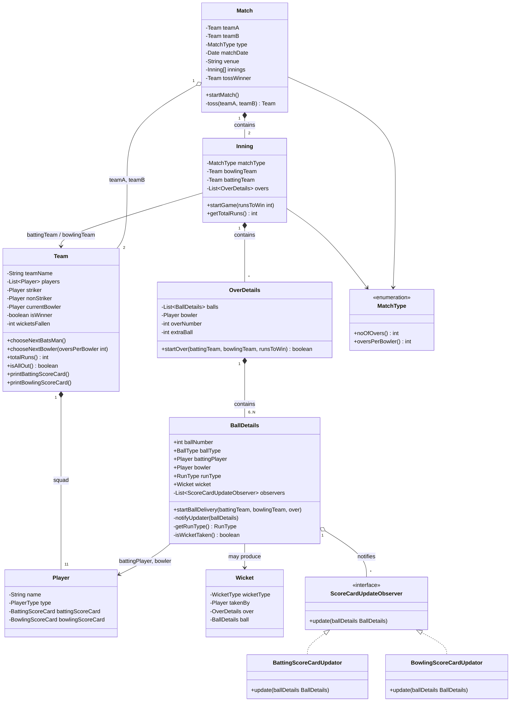
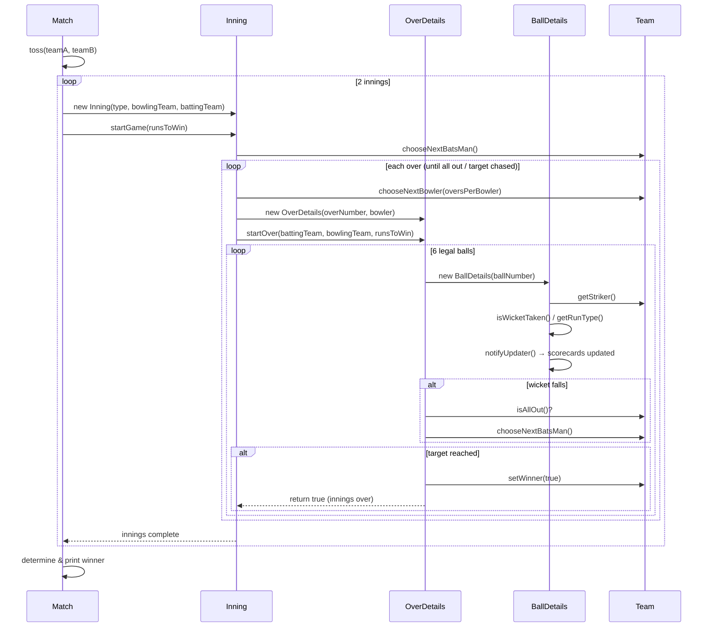

# Cricbuzz — Low Level Design (Cricket Match Simulator)

A simplified simulation of a limited-overs cricket match — toss, innings, overs,
ball-by-ball delivery, scorecards, and winner determination — built as a
Low-Level Design (LLD) practice project.

## Features

- Coin toss to decide who bats first
- Two-innings simulation (with second innings chasing a target)
- Over-by-over, ball-by-ball delivery simulation
- Batting & bowling scorecards per team
- Wicket tracking with automatic next-batsman selection
- Bowler rotation with a per-bowler overs cap
- Innings ends early on **all out** or on **target chased**
- Observer-based scorecard updates (batting + bowling updated independently per ball)

## Package Structure

```
cricbuzz
├── match/            → Match, MatchType
├── innings/          → Inning
├── ballDetails/       → BallDetails, OverDetails, BallType, RunType
├── teams/            → Team, Player, PlayerType
├── teams/scoreCard/   → BattingScoreCard, BowlingScoreCard
├── scoreCardUpdator/  → ScoreCardUpdateObserver, BattingScoreCardUpdator, BowlingScoreCardUpdator
└── wicket/           → Wicket, WicketType
```

## Class Diagram



## Sequence Diagram — Playing a Match



## Key Design Decisions

- **Observer pattern** for scorecards — `BallDetails` doesn't know how to update
  batting/bowling scorecards itself; it just notifies registered
  `ScoreCardUpdateObserver`s after each ball, keeping batting and bowling
  stat-tracking decoupled.
- **Toss winner always bats first** — a simplifying assumption (real cricket
  lets the toss winner choose to bat or field).
- **Innings termination** is driven by two independent conditions checked
  after every ball: `battingTeam.isAllOut()` and `battingTeam.totalRuns() >= runsToWin`.

## Known Limitations / Possible Extensions

- Extra deliveries (wides/no-balls) are counted (`extraBall`) but don't yet
  add runs or appear in the scorecard.
- No support for a tied match beyond the base win/loss check.
- Toss doesn't support "elect to bowl."
- `MatchType` currently assumed to be limited-overs (T20/ODI style); no Test
  match (multi-innings, multi-day) support.

## Running It

```bash
javac -d out $(find src -name "*.java")
java -cp out cricbuzz.Main
```

## Sample Output

```
INNING 1 -- total Run: 118
---Batting ScoreCard : SriLanka---
PlayerName: SriLanka1 -- totalRuns: 16 -- totalBallsPlayed: 5 -- 4s: 0 -- 6s: 2 -- outby: India8
PlayerName: SriLanka2 -- totalRuns: 0 -- totalBallsPlayed: 1 -- 4s: 0 -- 6s: 0 -- outby: India9
PlayerName: SriLanka3 -- totalRuns: 6 -- totalBallsPlayed: 2 -- 4s: 0 -- 6s: 1 -- outby: India9
PlayerName: SriLanka4 -- totalRuns: 30 -- totalBallsPlayed: 9 -- 4s: 0 -- 6s: 4 -- outby: India9
PlayerName: SriLanka5 -- totalRuns: 4 -- totalBallsPlayed: 2 -- 4s: 1 -- 6s: 0 -- outby: India10
PlayerName: SriLanka6 -- totalRuns: 9 -- totalBallsPlayed: 4 -- 4s: 0 -- 6s: 1 -- outby: India11
PlayerName: SriLanka7 -- totalRuns: 25 -- totalBallsPlayed: 7 -- 4s: 1 -- 6s: 3 -- outby: India8
PlayerName: SriLanka8 -- totalRuns: 4 -- totalBallsPlayed: 3 -- 4s: 0 -- 6s: 0 -- outby: India8
PlayerName: SriLanka9 -- totalRuns: 16 -- totalBallsPlayed: 4 -- 4s: 1 -- 6s: 2 -- outby: India10
PlayerName: SriLanka10 -- totalRuns: 1 -- totalBallsPlayed: 2 -- 4s: 0 -- 6s: 0 -- outby: India10
PlayerName: SriLanka11 -- totalRuns: 7 -- totalBallsPlayed: 2 -- 4s: 0 -- 6s: 1 -- outby: notout

---Bowling ScoreCard : India---
PlayerName: India8 -- totalOversThrown: 2 -- totalRunsGiven: 36 -- WicketsTaken: 3
PlayerName: India9 -- totalOversThrown: 2 -- totalRunsGiven: 38 -- WicketsTaken: 3
PlayerName: India10 -- totalOversThrown: 1 -- totalRunsGiven: 23 -- WicketsTaken: 3
PlayerName: India11 -- totalOversThrown: 1 -- totalRunsGiven: 21 -- WicketsTaken: 1

INNING 2 -- total Run: 119
---Batting ScoreCard : India---
PlayerName: India1 -- totalRuns: 8 -- totalBallsPlayed: 3 -- 4s: 2 -- 6s: 0 -- outby: SriLanka8
PlayerName: India2 -- totalRuns: 22 -- totalBallsPlayed: 5 -- 4s: 1 -- 6s: 3 -- outby: SriLanka10
PlayerName: India3 -- totalRuns: 25 -- totalBallsPlayed: 9 -- 4s: 3 -- 6s: 1 -- outby: SriLanka11
PlayerName: India4 -- totalRuns: 12 -- totalBallsPlayed: 4 -- 4s: 1 -- 6s: 1 -- outby: SriLanka11
PlayerName: India5 -- totalRuns: 19 -- totalBallsPlayed: 5 -- 4s: 0 -- 6s: 3 -- outby: SriLanka9
PlayerName: India6 -- totalRuns: 25 -- totalBallsPlayed: 8 -- 4s: 2 -- 6s: 2 -- outby: SriLanka8
PlayerName: India7 -- totalRuns: 0 -- totalBallsPlayed: 0 -- 4s: 0 -- 6s: 0 -- outby: notout
PlayerName: India8 -- totalRuns: 8 -- totalBallsPlayed: 2 -- 4s: 0 -- 6s: 1 -- outby: notout
PlayerName: India9 -- totalRuns: 0 -- totalBallsPlayed: 0 -- 4s: 0 -- 6s: 0 -- outby: notout
PlayerName: India10 -- totalRuns: 0 -- totalBallsPlayed: 0 -- 4s: 0 -- 6s: 0 -- outby: notout
PlayerName: India11 -- totalRuns: 0 -- totalBallsPlayed: 0 -- 4s: 0 -- 6s: 0 -- outby: notout

---Bowling ScoreCard : SriLanka---
PlayerName: SriLanka8 -- totalOversThrown: 2 -- totalRunsGiven: 39 -- WicketsTaken: 2
PlayerName: SriLanka9 -- totalOversThrown: 2 -- totalRunsGiven: 48 -- WicketsTaken: 1
PlayerName: SriLanka10 -- totalOversThrown: 1 -- totalRunsGiven: 22 -- WicketsTaken: 1
PlayerName: SriLanka11 -- totalOversThrown: 1 -- totalRunsGiven: 10 -- WicketsTaken: 2

---WINNER---India
```