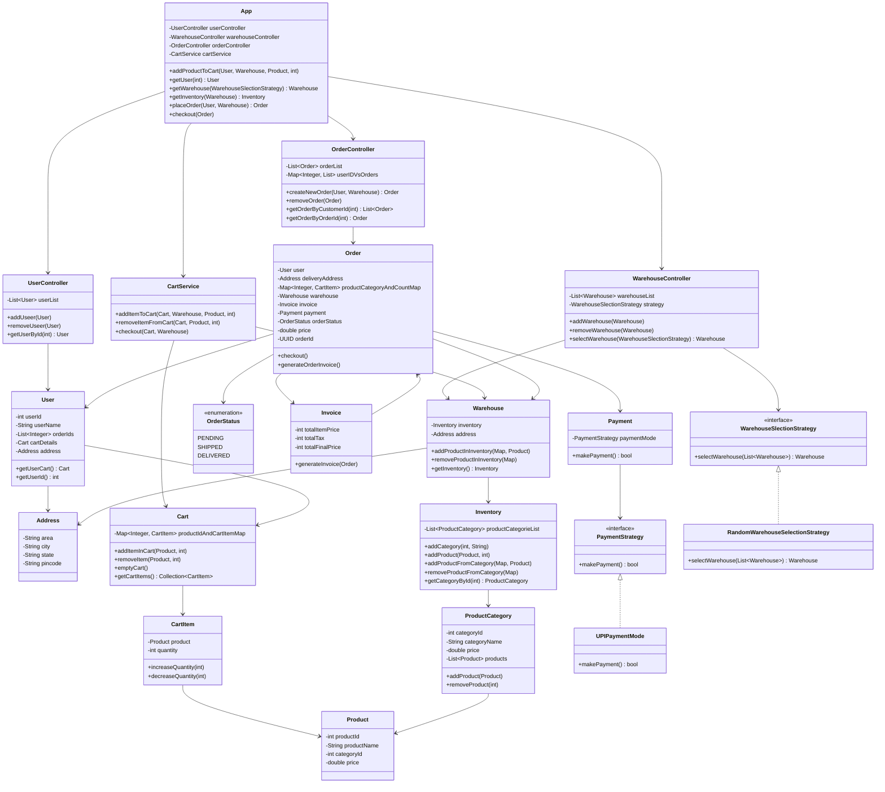
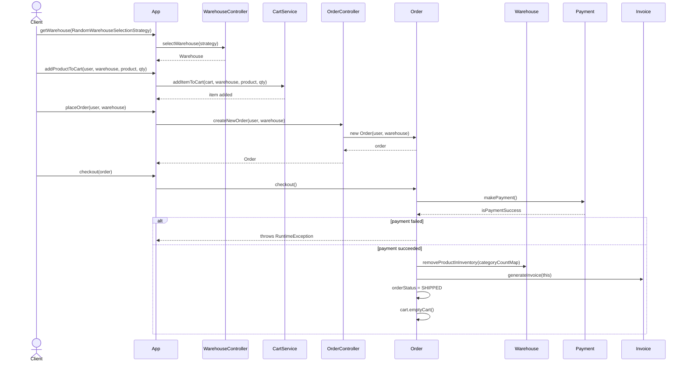

# Inventory Management System (LLD)

A low-level design implementation of a warehouse-based inventory & order management system in **Java**, built as an interview-prep exercise. The system models multiple warehouses each maintaining their own inventory, lets users add items to a cart, and walks through order creation, checkout, and payment.

This project focuses on clean **object-oriented design**, **separation of concerns**, and the use of the **Strategy** and **Facade** patterns to keep the design extensible.

---

## Table of Contents

- [Problem Statement](#problem-statement)
- [Features](#features)
- [Design Patterns Used](#design-patterns-used)
- [Project Structure](#project-structure)
- [UML Class Diagram](#uml-class-diagram)
- [Order Flow (Sequence Diagram)](#order-flow-sequence-diagram)
- [Class Overview](#class-overview)
- [How to Run](#how-to-run)
- [Sample Output](#sample-output)
- [Future Enhancements](#future-enhancements)

---

## Problem Statement

Design a system that supports:

- Multiple **warehouses**, each with its own **inventory** of product categories and products.
- **Users** who can browse products, add them to a **cart**, and place an **order**.
- Selecting a warehouse to fulfil an order using a pluggable **selection strategy**.
- Generating an **invoice** and processing **payment** for an order.
- Updating warehouse inventory once an order is checked out.

---

## Features

- Add/remove product categories and products in a warehouse's inventory.
- Add/remove items from a user's cart with quantity tracking.
- Pluggable **warehouse selection strategy** (currently random selection; nearest-warehouse selection can be plugged in later).
- Pluggable **payment strategy** (currently UPI; other modes can be added without touching `Order` or `Payment`).
- Order creation, checkout, invoice generation, and inventory deduction.
- Order history lookup by user ID or order ID via `OrderController`.

---

## Design Patterns Used

| Pattern | Where | Why |
|---|---|---|
| **Strategy** | `WarehouseSlectionStrategy` (→ `RandomWarehouseSelectionStrategy`), `PaymentStrategy` (→ `UPIPaymentMode`) | Lets warehouse selection logic and payment processing vary independently and be swapped at runtime without changing `WarehouseController`, `Order`, or `Payment`. |
| **Facade** | `App` | Provides a single, simplified entry point (`addProductToCart`, `placeOrder`, `checkout`, etc.) that hides the coordination between `UserController`, `WarehouseController`, `OrderController`, and `CartService`. |
| **Layered / MVC-ish separation** | `model` vs `controllers` vs `selectionStrategy` | Domain entities, orchestration logic, and pluggable algorithms are kept in separate packages for clarity and testability. |

---

## Project Structure

```
inventoryManagementSystem
├── controllers
│   ├── CartService.java
│   ├── OrderController.java
│   ├── UserController.java
│   └── WarehouseController.java
├── model
│   ├── Address.java
│   ├── Cart.java
│   ├── CartItem.java
│   ├── Inventory.java
│   ├── Invoice.java
│   ├── Order.java
│   ├── OrderStatus.java
│   ├── Payment.java
│   ├── Product.java
│   ├── ProductCategory.java
│   ├── User.java
│   └── Warehouse.java
├── selectionStrategy
│   ├── PaymentStrategy.java
│   ├── RandomWarehouseSelectionStrategy.java
│   ├── UPIPaymentMode.java
│   └── WarehouseSlectionStrategy.java
├── App.java
└── Main.java
```

---

## UML Class Diagram



---

## Order Flow (Sequence Diagram)



---

## Class Overview

### Model Layer
| Class | Responsibility |
|---|---|
| `User` | Represents a customer — holds identity, address, cart, and order history. |
| `Address` | Value object for area/city/state/pincode. |
| `Cart` | Holds a map of `productId → CartItem` for a user. |
| `CartItem` | A product + quantity pairing inside a cart. |
| `Warehouse` | Holds an `Inventory` and an `Address`; source of truth for stock at a location. |
| `Inventory` | Holds `ProductCategory` list; supports adding/removing products by category. |
| `ProductCategory` | Groups products of the same type and tracks category-level price. |
| `Product` | A sellable item with id, name, category, and price. |
| `Order` | Snapshots a user's cart into an order, drives checkout, invoice, and inventory deduction. `orderId` is assigned a random `UUID` at creation; `orderStatus` starts `PENDING` and moves to `SHIPPED` once checkout succeeds. |
| `OrderStatus` | Enum: `PENDING`, `SHIPPED`, `DELIVERED`. |
| `Invoice` | Computes item total, tax, and final price for an order. |
| `Payment` | Wraps a `PaymentStrategy` to execute payment. |

### Controller Layer
| Class | Responsibility |
|---|---|
| `UserController` | CRUD-style access to users. |
| `WarehouseController` | CRUD-style access to warehouses + delegates warehouse selection to a strategy. |
| `OrderController` | Creates orders, and looks them up by user or order id. |
| `CartService` | Validates stock and mutates a user's cart; also exposes an alternate checkout path. |

### Strategy Layer
| Class | Responsibility |
|---|---|
| `WarehouseSlectionStrategy` | Interface for picking a warehouse to fulfil an order. |
| `RandomWarehouseSelectionStrategy` | Picks a random warehouse from the list. |
| `PaymentStrategy` | Interface for processing a payment. |
| `UPIPaymentMode` | Stub UPI payment implementation. |

### Facade
| Class | Responsibility |
|---|---|
| `App` | Single entry point wiring together all controllers and services for client code (`Main`). |

---

## How to Run

```bash
# From the project root
javac inventoryManagementSystem/**/*.java inventoryManagementSystem/*.java
java inventoryManagementSystem.Main
```

`Main.java` demonstrates the full flow:
1. Create a warehouse and populate its inventory with categories and products.
2. Create a user.
3. Wire everything up via `App`.
4. Select a warehouse, add a product to the cart, place an order, and check out.

---

## Sample Output

```
Order placed successfully!
```

---

## Future Enhancements

- Add a `NearestWarehouseSelectionStrategy` to demonstrate the Strategy pattern's extensibility.
- Support the full `OrderStatus` lifecycle (e.g. `SHIPPED → DELIVERED`) triggered by delivery/warehouse events.
- Add more `PaymentStrategy` implementations (Card, Wallet, COD).
- Introduce exception classes instead of generic `IllegalArgumentException`/`RuntimeException`.
- Fix `Invoice.totalItemPrice`/`totalFinalPrice` being declared as `int` while summing a `double` price (currently truncates decimals).
- Add unit tests (JUnit) for `Inventory`, `Cart`, and `Order` checkout logic.

---

## Author

**Deepali Srivastava**
B.Tech CSE, Lovely Professional University