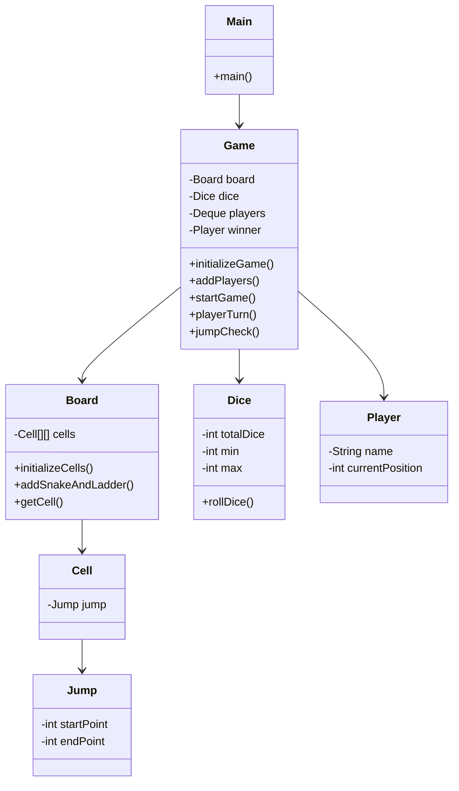
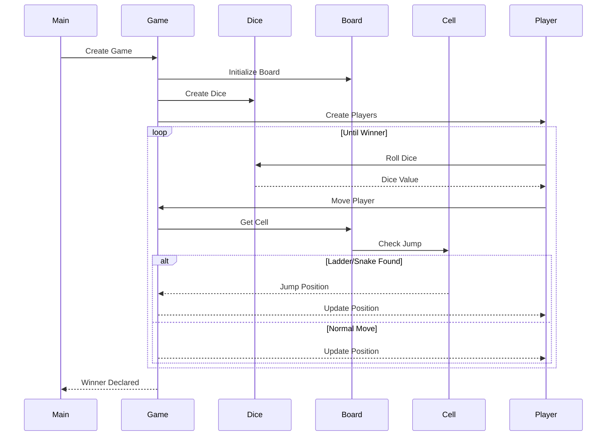

# 🐍 Snake and Ladder Game - Low Level Design (LLD)

A Java implementation of the classic **Snake and Ladder** game demonstrating **Low Level Design (LLD)** and **Object-Oriented Programming (OOP)** concepts.

The project models the complete game using modular classes such as `Board`, `Game`, `Player`, `Dice`, `Cell`, and `Jump`, making the code clean, scalable, and easy to understand.

---

## 📖 Project Overview

The game initializes a board with randomly placed snakes and ladders. Players take turns rolling a dice and moving across the board. If a player lands on:

- 🪜 **Ladder** → Moves upward
- 🐍 **Snake** → Slides downward

The first player to reach the last cell wins the game.

The project focuses on designing the game using proper class responsibilities instead of building a graphical interface.

---

# ✨ Features

- Dynamic board creation
- Random snake generation
- Random ladder generation
- Turn-based gameplay
- Multiple player support
- Dice rolling simulation
- Automatic snake & ladder traversal
- Winner detection
- Clean Object-Oriented Design

---

# 🛠️ Tech Stack

- Java
- OOP
- Collections Framework
- Queue (Deque)
- ThreadLocalRandom

---

# 📂 Project Structure

```
snakeandladder
│
├── Main.java
├── Game.java
├── Board.java
├── Dice.java
├── Player.java
├── Cell.java
└── Jump.java
```

---

# 📚 Class Responsibilities

## Main

Entry point of the application.

Responsibilities:

- Creates Game object
- Starts the game

---

## Game

Acts as the controller of the application.

Responsibilities:

- Initialize board
- Create players
- Maintain player queue
- Roll dice
- Move players
- Check snakes & ladders
- Detect winner

---

## Board

Represents the game board.

Responsibilities:

- Create board cells
- Randomly place snakes
- Randomly place ladders
- Return a cell for a given position

---

## Cell

Represents a single board cell.

Each cell may contain:

- Snake
- Ladder
- Empty

---

## Jump

Represents both:

- Snake
- Ladder

A Jump contains:

- Start Position
- End Position

If

```
Start < End
```

➡ Ladder

If

```
Start > End
```

➡ Snake

---

## Dice

Responsible for generating random dice values.

Current implementation:

- Single Dice
- Random values

---

## Player

Stores player information.

Attributes:

- Player Name
- Current Position

---

# 🧩 UML Class Diagram



---

# 🔄 Sequence Diagram



---

# 🎮 Game Flow

```text
            Start
              │
              ▼
      Initialize Game
              │
              ▼
     Create Board & Dice
              │
              ▼
      Add Players Queue
              │
              ▼
       Current Player
              │
              ▼
          Roll Dice
              │
              ▼
      Calculate Position
              │
              ▼
     Snake/Ladder Present?
          /          \
        Yes          No
         │            │
     Jump Position    │
         │            │
         └──────┬─────┘
                ▼
      Reached Last Cell?
          /         \
       Yes          No
        │            │
  Declare Winner   Next Turn
```

---

# 💡 OOP Concepts Used

### Encapsulation

Each class manages its own data and behavior.

Example:

- Player manages player details.
- Dice manages dice rolling.
- Board manages cells.

---

### Composition

The game is composed of multiple objects.

```
Game
 ├── Board
 ├── Dice
 └── Players
```

---

### Abstraction

Each class exposes only the operations required by other classes.

Examples:

- rollDice()
- getCell()
- jumpCheck()

---

### Single Responsibility Principle (SRP)

Each class performs only one major responsibility.

| Class | Responsibility |
|--------|----------------|
| Game | Controls gameplay |
| Board | Creates board |
| Dice | Generates random numbers |
| Player | Stores player data |
| Cell | Stores jump |
| Jump | Represents snake/ladder |

---

# 🚀 How to Run

Compile

```bash
javac *.java
```

Run

```bash
java Main
```

---

# 🖥️ Sample Output

```
Player name: Deepali Current Position: 0

Dice rolled: 5

Player name: Deepali New Position: 5

Player name: Vaishnavi Current Position: 0

Dice rolled: 3

There is a Ladder for 15

Player name: Vaishnavi New Position: 15

...

Winner is: Deepali
```

---

# 📈 Time Complexity

| Operation | Complexity |
|------------|------------|
| Roll Dice | O(1) |
| Move Player | O(1) |
| Get Cell | O(1) |
| Jump Check | O(1) |
| Player Turn | O(1) |

Overall Game Complexity depends on the number of turns until a player wins.

---

# 🔮 Future Enhancements

- Custom board size
- Manual snake & ladder placement
- Multiple dice support
- GUI using Java Swing / JavaFX
- Save & Load Game
- Multiplayer over network
- Better board visualization
- Configurable number of players

---

# 📚 Learning Outcomes

This project demonstrates:

- Low Level Design (LLD)
- Object-Oriented Programming
- Class Relationships
- Composition
- Queue-based turn management
- Randomized board generation
- Clean Java design

---

# 👩‍💻 Author

**Deepali Srivastava**

B.Tech Computer Science Engineering (2026)

**Skills:** Java • Spring Boot • DSA • OOP • SQL • Git • Low Level Design