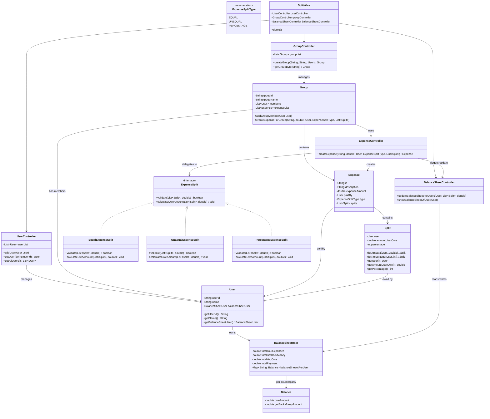

# 💸 Splitwise — Low Level Design (LLD)

A ground-up, object-oriented implementation of **Splitwise** in Java — built to demonstrate clean **Low Level System Design**, SOLID principles, and common design patterns used in real-world backend engineering interviews.

> Split expenses. Track balances. Settle up. All without a database — pure OOP.

---

## 📌 Overview

This project models the core engine behind an expense-splitting app like Splitwise. It supports:

- 👤 Onboarding users
- 👥 Creating groups and adding/removing members
- 🧾 Creating expenses with **three different split strategies**
- ⚖️ Maintaining a live, per-user, per-counterparty balance sheet
- 📊 Viewing "who owes whom, and how much" — net of all transactions

Built as a **class-design-first** exercise — the kind of problem commonly asked in LLD/Machine Coding rounds at product companies (Amazon, Uber, Ola, etc.)

---

## ✨ Features

| Feature | Description |
|---|---|
| **Equal Split** | Expense divided equally among all participants |
| **Exact / Unequal Split** | Each participant owes a custom, explicit amount |
| **Percentage Split** | Each participant owes a % share of the total (validated to sum to 100%) |
| **Group Management** | Create groups, add members, isolate group-level expenses |
| **Balance Sheet Engine** | Tracks `TotalPaid`, `TotalOwed`, `GetBack`, `Owe` per user, and per counterparty |
| **Net Settlement View** | Collapses raw debits/credits into a single net "you owe / owes you" figure per person |
| **Extensible Split Strategy** | New split types can be added without touching existing code (Strategy Pattern) |

---

## 🏗️ Design Patterns Used

| Pattern | Where | Why |
|---|---|---|
| **Strategy Pattern** | `ExpenseSplit` interface + `EqualExpenseSplit`, `UnEqualExpenseSplit`, `PercentageExpenseSplit` | Swap split-calculation logic at runtime based on `ExpenseSplitType`, without `if-else` chains |
| **Factory Method** | `Split.forAmount()` / `Split.forPercentage()` | Avoids ambiguous constructor overloading and makes object creation intent-revealing |
| **Controller Pattern** | `UserController`, `GroupController`, `ExpenseController`, `BalanceSheetController` | Separates orchestration logic from data (POJOs), keeping domain models thin |
| **Single Responsibility Principle** | Every class does exactly one thing — `Group` doesn't calculate balances, `BalanceSheetController` doesn't validate splits | Improves testability and maintainability |
| **Open/Closed Principle** | Adding a new split type = new class implementing `ExpenseSplit`, zero changes to `ExpenseController` | Core OOP design goal of this project |

---

## 🗂️ Project Structure

```
splitwise/
├── user/
│   ├── User.java
│   └── UserController.java
├── group/
│   ├── Group.java
│   └── GroupController.java
├── expenses/
│   ├── Expense.java
│   ├── ExpenseController.java
│   ├── ExpenseSplitType.java
│   └── split/
│       ├── Split.java
│       ├── ExpenseSplit.java              (interface)
│       ├── EqualExpenseSplit.java
│       ├── UnEqualExpenseSplit.java
│       └── PercentageExpenseSplit.java
├── balanceSheet/
│   ├── Balance.java
│   ├── BalanceSheetUser.java
│   └── BalanceSheetController.java
├── SplitWise.java
└── Demo.java
```

---

## 📐 UML Class Diagram



> 💡 This diagram renders natively on GitHub — no extra tooling or image export needed.

---

## 🔄 Core Flow

1. **Onboard users** → `UserController.addUser()`
2. **Create a group** → `GroupController.createGroup()` (creator auto-joins)
3. **Add members** → `Group.addGroupMember()`
4. **Create an expense** → `Group.createExpenseForGroup()`
    - Delegates to the correct `ExpenseSplit` strategy based on `ExpenseSplitType`
    - **Validates** the split (e.g. percentages sum to 100, exact amounts sum to total)
    - **Calculates** `amountUserOwe` for each participant
    - Triggers `BalanceSheetController.updateBalanceSheetForUsers()` to update both sides of every debt
5. **View balances** → `BalanceSheetController.showBalanceSheetOfUser()` prints a **net** balance per counterparty (`owes you` / `you owe` / `settled up`)

---

## ▶️ Sample Output

```
---------------------------------------
Balance sheet of user : U1001
TotalYourExpense: 490.0
TotalGetBack: 810.0
TotalYourOwe: 400.0
TotalPaymnetMade: 900.0
userID:U2001 you owe: 220.0
userID:U3001 owes you: 630.0
---------------------------------------
---------------------------------------
Balance sheet of user : U2001
TotalYourExpense: 280.0
TotalGetBack: 400.0
TotalYourOwe: 180.0
TotalPaymnetMade: 500.0
userID:U1001 owes you: 220.0
---------------------------------------
---------------------------------------
Balance sheet of user : U3001
TotalYourExpense: 630.0
TotalGetBack: 0.0
TotalYourOwe: 630.0
TotalPaymnetMade: 0.0
userID:U1001 you owe: 630.0
---------------------------------------
```

---

## 🚀 Getting Started

### Prerequisites
- JDK 17+ (tested on JDK 24)
- Any IDE (IntelliJ IDEA recommended) or plain `javac`

### Run it

```bash
git clone https://github.com/<your-username>/splitwise-lld.git
cd splitwise-lld
javac -d out $(find src -name "*.java")
java -cp out splitwise.Demo
```

Or simply open the project in IntelliJ and run `Demo.java`.

---

## 🧪 Design Decisions & Trade-offs

- **Why a Strategy pattern for splits, not `if-else`?** New split types (e.g. `SHARE`-based splitting) can be added by just implementing `ExpenseSplit` — the `ExpenseController` never changes. This is the **Open/Closed Principle** in action.
- **Why static factory methods on `Split` instead of overloaded constructors?** `Split(User, double)` and `Split(User, int)` are ambiguous for integer literals in Java — the compiler silently prefers the `int` overload, causing subtle bugs. `Split.forAmount()` / `Split.forPercentage()` make intent explicit and eliminate that entire bug class.
- **Why store balances bidirectionally (`Balance` per counterparty on both users)?** Enables O(1) lookup of "what does X owe Y" from either user's perspective, and makes the per-user balance sheet self-contained without needing a global ledger scan.
- **Why net the balance at display time, not storage time?** Keeps the underlying `GetBack`/`Owe` amounts fully auditable (you can always see gross flows), while still giving users the simple net figure they actually care about.

---

## 🔮 Future Enhancements

- [ ] Persist data with a real database (currently in-memory)
- [ ] `SHARE`-based splitting (e.g. split by "weights" like 1:2:3)
- [ ] Expense edit/delete with balance reversal
- [ ] Group-level "settle up" / simplify debts algorithm (minimize number of transactions)
- [ ] REST API layer (Spring Boot) on top of this core engine
- [ ] Unit tests (JUnit) for each `ExpenseSplit` strategy

---

## 🧑‍💻 About This Project

Built as a hands-on Low Level Design practice project — focused on writing interview-quality, extensible, SOLID-compliant Java from scratch rather than using a framework. If you're prepping for LLD/Machine Coding interviews, feel free to fork this and extend it with your own split types or persistence layer.

⭐ If this helped you understand LLD better, consider starring the repo!